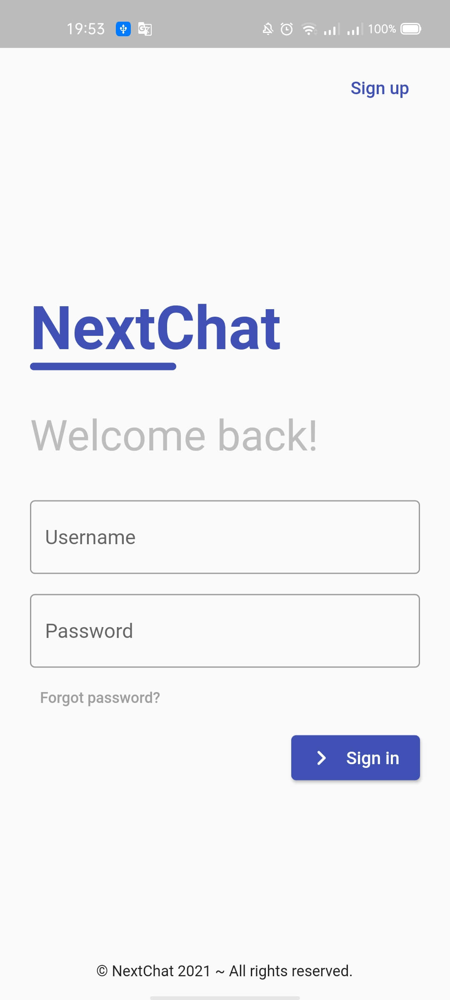
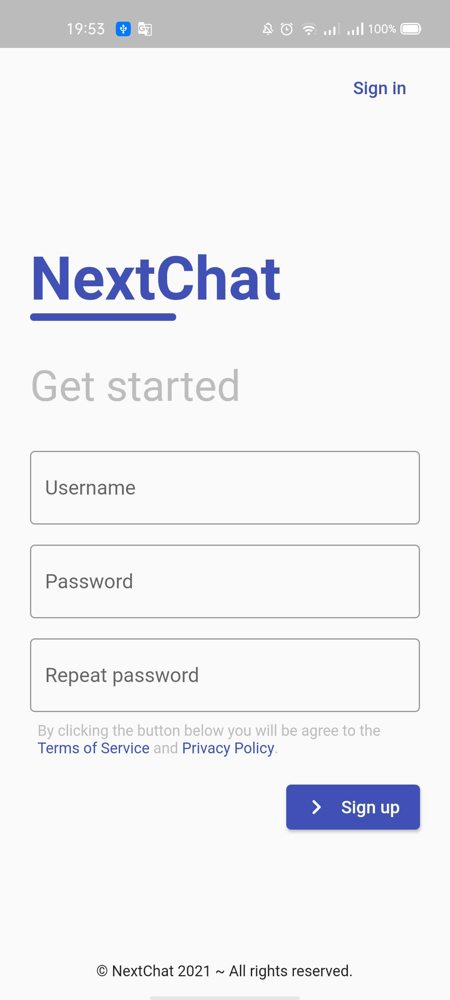

# NextChat Mobile
This repository contains the source code of the mobile application for NextChat written with Flutter.

## Getting Started
1. Clone this repository:
```sh
git clone https://github.com/NextChatORG/mobile.git
```
Or using GitHub CLI:
```sh
gh repo clone NextChatORG/mobile
```

2. Create the `lib/settings.dart` file based on `lib/settings.dart.example` file.

3. Execute the code:
```sh
flutter run
```

4. (Optional) Configure the reverse TCP port connection if you use `localhost` as API host:
```sh
adb reverse tcp:5000 tcp:5000
```

## Preview





## Authors
-   [@danielsolartech](https://github.com/danielsolartech) - Initial project
-   [@JheysonDev](https://github.com/JheysonDev) - Icon Design
-   [@TeoDev1611](https://github.com/TeoDev1611) - Icon Design

## Changelog
View the lastest repository changes in the [CHANGELOG.md](./CHANGELOG.md) file.

## Copyright
License: GPL-2.0

Read file [LICENSE](./LICENSE) for more information.
